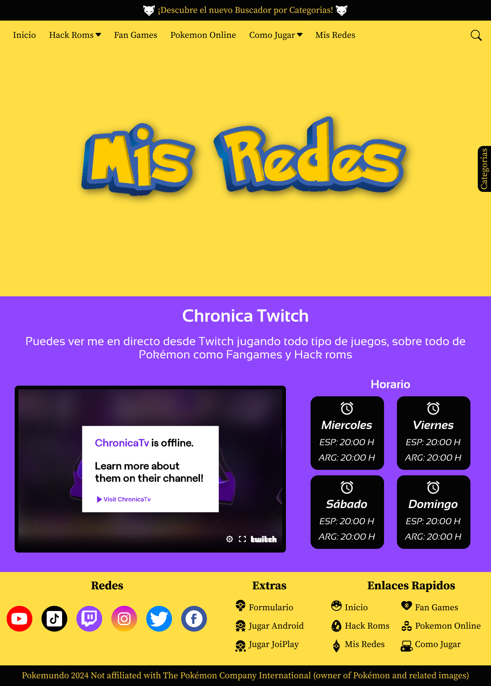
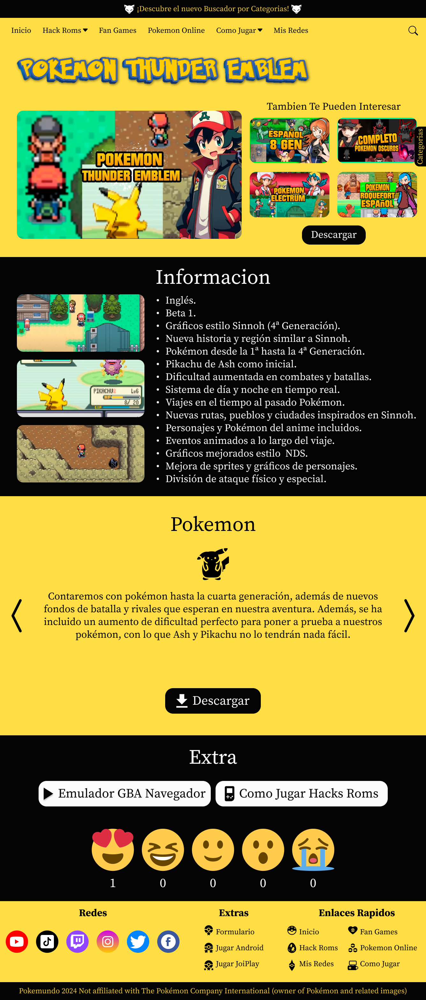
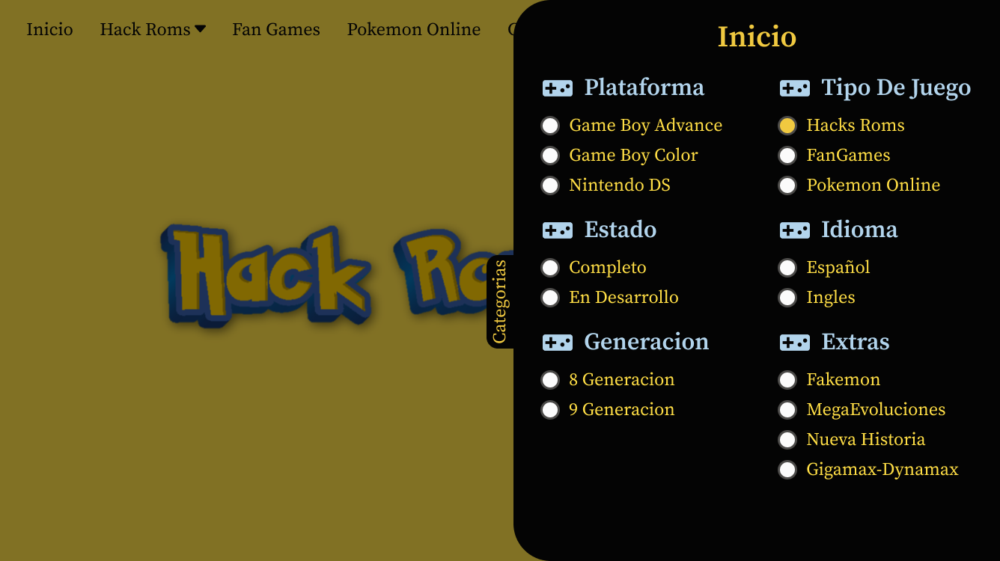

# Pokemundo-Rework

Este repositorio contiene el Rework del diseño y desarrollo del sitio web de Pokemundo, una plataforma dedicada a la promoción y descarga de fangames y hackroms de Pokémon. El objetivo del proyecto es ofrecer una web atractiva, moderna y funcional que permita a los usuarios descubrir, explorar y descargar sus juegos de Pokémon favoritos de manera rápida y segura.

La plataforma ha sido diseñada para garantizar una experiencia de usuario fluida, con especial atención a la accesibilidad y velocidad de navegación.

# Pagina Principal

# Categorias

# Mis Redes

# Descarga de juegos

# Menu despegable

# copy

**Todo el contenido es de la autoridad de Chronica y no debe ser distribuido sin el permiso de la autora de la marca Pokemundo: [Chronica YT](https://www.youtube.com/@chronicayt)/[Pokemundo.com](https://pokemundo.com/)**

**Derechos De Autor para @Pokemundo**
